# Data Visualization and Analysis

In this project, we selected three datasets for visualization and analysis:

### 1. Heart Attack Prediction Dataset (India)
This dataset contains key medical and lifestyle factors related to heart disease risk. Below is a sample of the data:

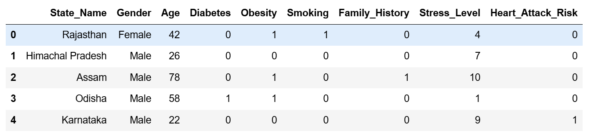

---

### 2. Mobile Dataset 2025
This dataset includes specifications and pricing information of mobile phones. Below is a sample of the data:

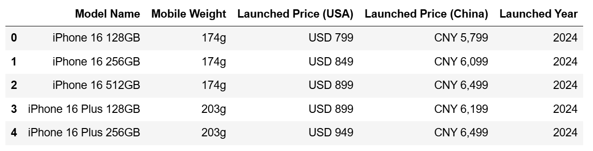

---

This dataset explores marriage trends, including factors like education level and marriage type. Below is a sample of the data:

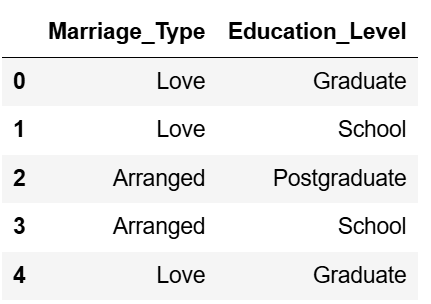

---

## Visualizations and Analysis

### 1. Heart Attack Prediction Dataset (India)
- **Age Groups and Heart Disease Risk**: A bar chart and KDE curve visualizing the number of people at risk of heart disease in different age groups.
- 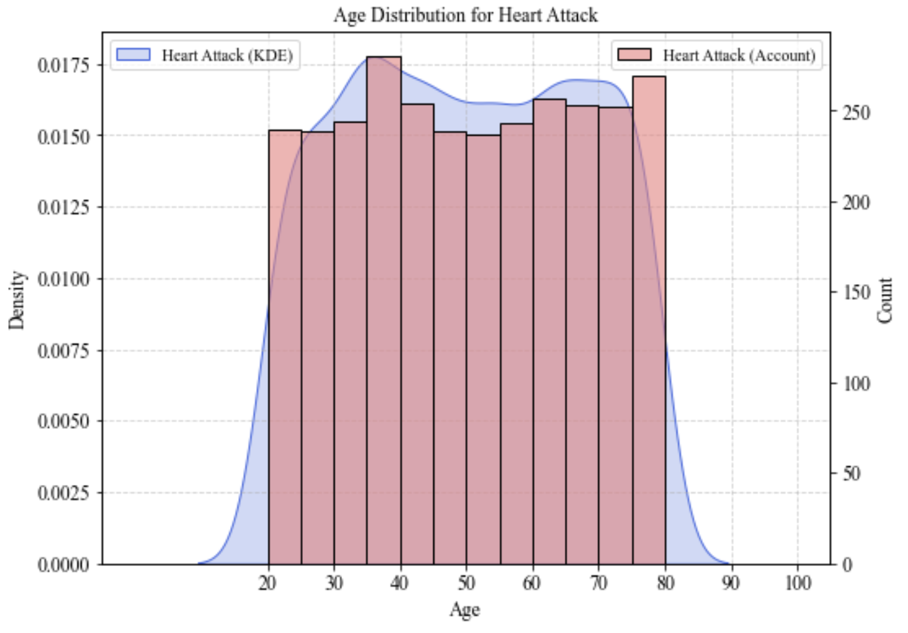
- **Heatmap**: A heatmap showing the relationship between three diseases and heart disease risk.
- 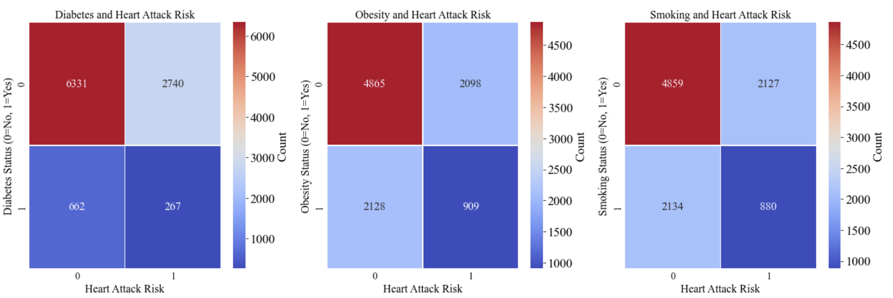
- **Gender-based Heart Disease Risk**: A pie chart comparing the heart disease risk proportions between males and females.
- 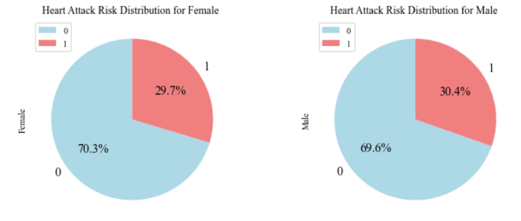
- **Top 15 Regions**: A bar chart showing the top 15 regions with the highest number of heart disease risk patients.
- 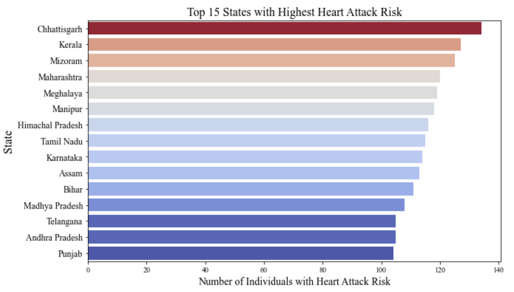

### 2. Mobile Dataset 2025
- **Price Trends of Apple Products**: A line chart showing the trend of average prices for Apple products in China over the years.
- 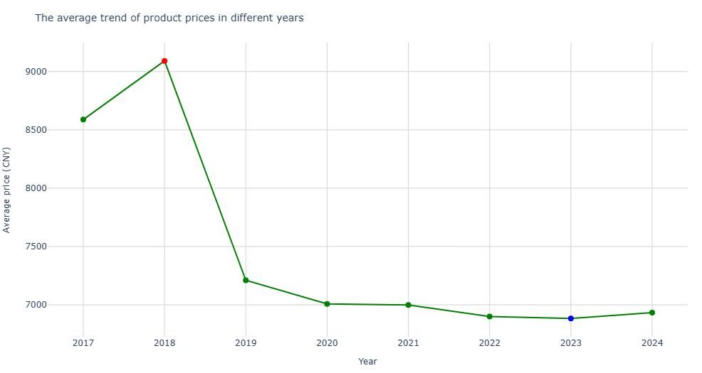
- **Phone Weight vs. Price**: A scatter plot illustrating the relationship between phone weight and price.
- 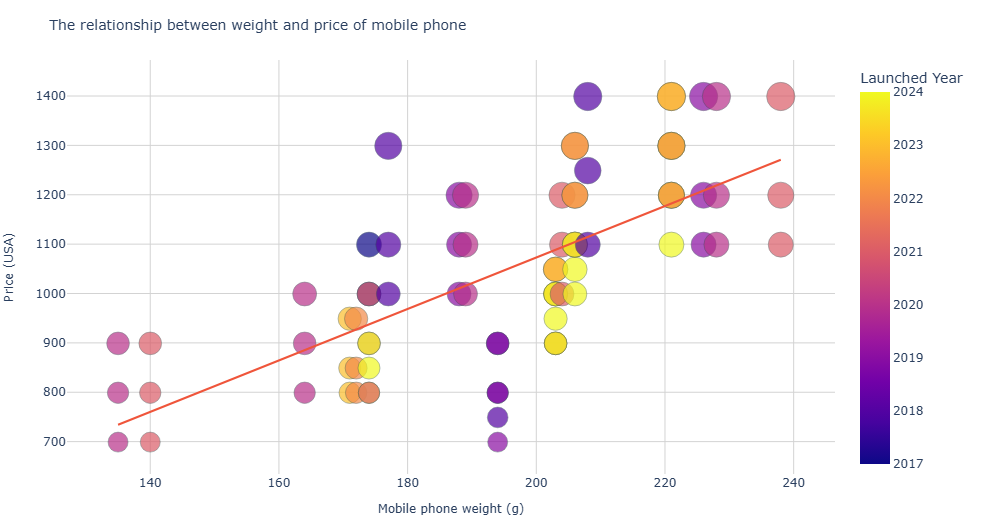
- **Price by Year**: A box plot visualizing the distribution of phone prices by year.
- 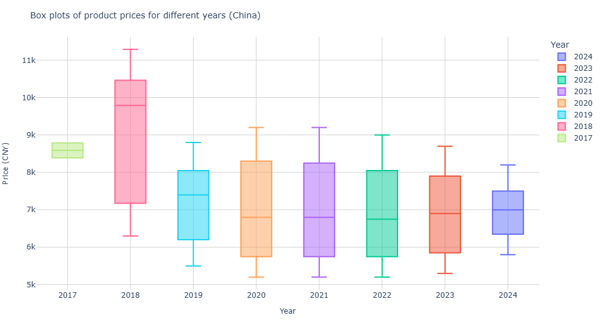
- 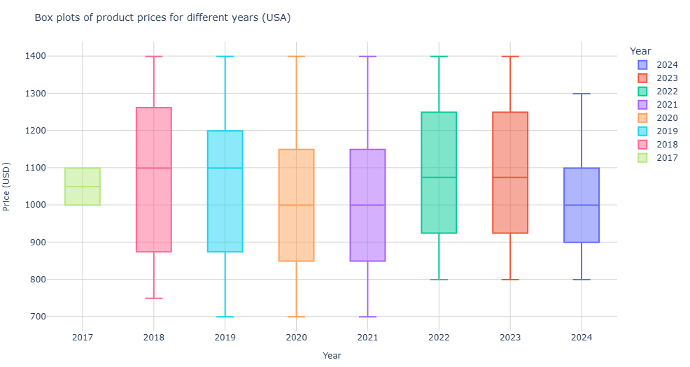
- **Pairplot**: A pairplot showing the relationships between various variables in the dataset.
- 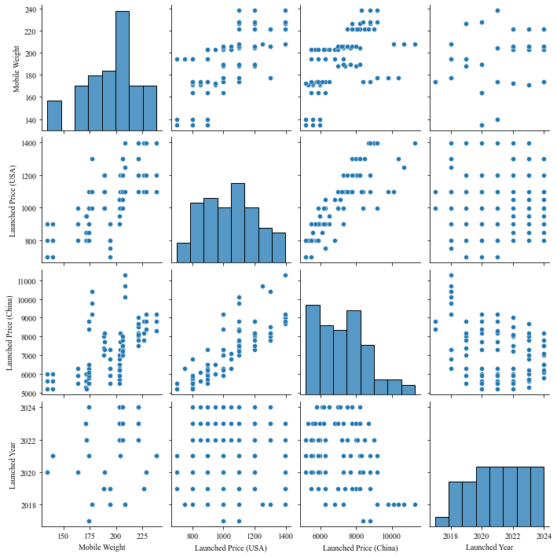

### 3. Marriage Data (India)
- **Education Level vs. Marriage Type**: A bar chart comparing education levels and the type of marriage (love vs. arranged).
- 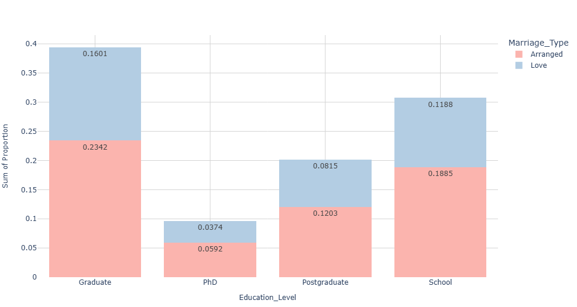

## Dataset Selection and Analysis
We selected these three datasets and performed a series of visualizations, followed by an analysis of the results. The insights gained from these visualizations provide valuable information on health risks, mobile pricing trends, 和 marriage patterns in India.

## Requirements
- Python 3.x
- pandas
- seaborn
- matplotlib
- plotly

## Summary
For more detailed analysis, please refer to the Homework 1.1_report.pdf.
